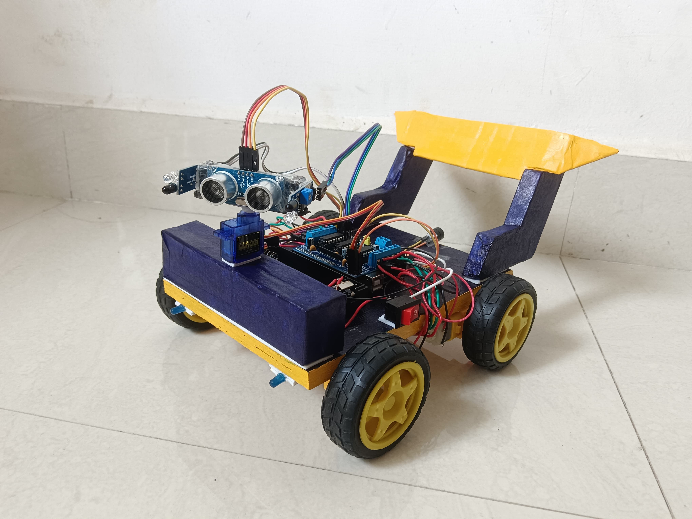

# 🤖 Human-Following Robot

A simple yet effective Arduino-powered robot designed to detect and follow a human target using distance and direction sensing. The robot leverages ultrasonic and IR sensors to determine proximity and movement, adjusting its motion accordingly (forward, stop, reverse).

## 🔧 Features

- **Human detection** using IR and ultrasonic sensors  
- **Motion control** with DC motors via L293D motor driver  
- **Distance sensing** using HC-SR04  
- **Direction feedback** through a servo-mounted ultrasonic sensor  
- **Obstacle alert** with a buzzer  
- **Compact and modular design**

## 🛠️ Tech Stack & Components

- **Microcontroller:** Arduino Uno  
- **Sensors:**  
  - HC-SR04 Ultrasonic Sensor  
  - IR Proximity Sensors  
- **Actuators:**  
  - DC Motors  
  - Servo Motor  
  - Buzzer  
- **Motor Driver:** L293D  
- **Power:** External battery pack or USB

## 📦 Project Structure

## 🚀 How It Works

1. **IR Sensors** detect presence and direction of a nearby object (human).
2. **Ultrasonic Sensor** measures distance from the object.
3. Based on the distance:
   - If too close → Stop or Reverse.
   - If within ideal range → Move Forward.
   - If object is lost → Stop and rotate to re-detect.
4. **Servo Motor** rotates the ultrasonic sensor for wider angle detection.
5. **L293D Driver** controls the direction and speed of the DC motors.
6. **Buzzer** alerts in case of very close proximity or obstacle.

## 🖼️ Screenshot

## 📽️ Future Improvements

- Add Bluetooth or Wi-Fi module for remote control
- Enable object/person re-identification
- Optimize path planning with more intelligent obstacle avoidance

## 🧑‍💻 Author

**Nishant Gaur**  
3rd Year ECE Student, IIIT Kottayam  

---

> 💡 *Feel free to fork, contribute, or suggest improvements!*

